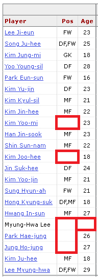
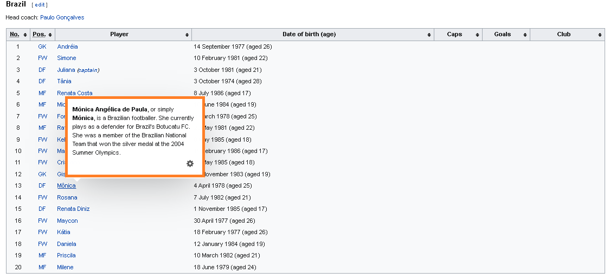
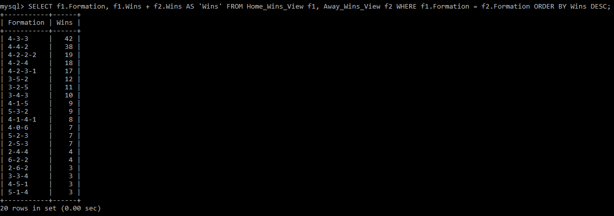
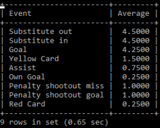
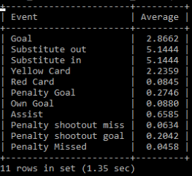
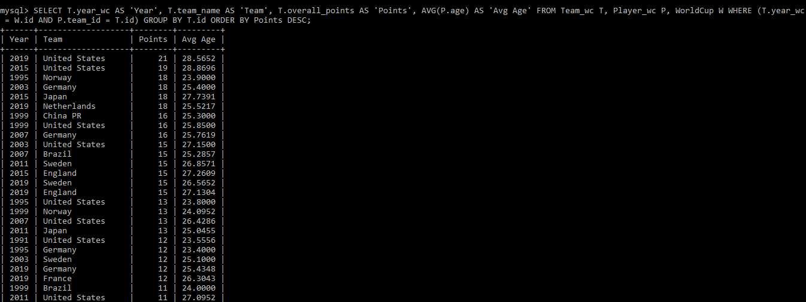

# Projeto `Construindo um dataset sobre a Copa do Mundo de Futebol Feminino`

# Equipe `AKERS` - `AKERS`

* `Arthur Cemin Baia` - `213259`
* `Fábio Santos Villar` - `234135`
* `José Augusto Nascimento Afonso Marcos` - `200025`

## Resumo do Projeto
> Nosso projeto consiste em reunir informações, em um banco de dados, sobre todas as copas do mundo de futebol feminino realizadas até hoje (1991 - 2019). O projeto envolve, principalmente, funções de webscraping, para retirar e agregar dados de múltiplas fontes não-estruturadas e apresentá-los em dois modelos: Relacional e Hierárquico.

## Slides da Apresentação

[Slides](https://github.com/FabioVillar/MC536-Projeto-Final/blob/main/previa/assets/Apresenta%C3%A7%C3%A3o%20Pr%C3%A9via%20-%20Akers.pdf)

## Modelo Conceitual

> Modelo de Entidade-Relacionamento:

## Modelos Lógicos

> Modelo lógico relacional:

~~~

WORLDCUP(_id_, host)

TEAM_WC(_id_, year_wc, team_name, coach, group_in_wc, group_points, goals_scored, overall_points, goals_conceded, wins, draws, losses)
  Ocupante chave estrangeira -> WorldCup(year_wc)

PLAYER_WC(_id_, team_id, player_name, age, position, goals, assists, yellow_cards, red_cards, year_wc)
  Ocupante chave estrangeira -> Team_wc(team_id)

MATCH_WC(_id_, penaltiesA, penaltiesB, phase, group_, teamA, teamB, scoreA, scoreB, stadium, attendance, referee, formationA, formationB, lineupA, lineupB, reservesA, reservesB, possession, year_wc)
  Ocupante chave estrangeira -> Team_wc(teamA)
  Ocupante chave estrangeira -> Team_wc(teamB)

EVENTS_WC(_id_, match_id, event_desc, match_time, team, player)
  Ocupante chave estrangeira -> Player_wc(player)
  Ocupante chave estrangeira -> Team_wc(team)
  Ocupante chave estrangeira -> Match_wc(match_id)

AWARDS_WC(award_type, year_wc, player_id, team)
  Ocupante chave estrangeira -> Player_wc(player_id)
  Ocupante chave estrangeira -> Team_wc(team)

~~~

> Modelo hierárquico:

## Dataset Preliminar a ser Publicado

| título do arquivo/base | link | breve descrição |
|----- | ----- | -----|
| `world_cup_1991.json` | [link](https://github.com/FabioVillar/MC536-Projeto-Final/blob/main/final/data/processed/world_cup1991.json) | `Documento JSON com os dados da Copa do mundo feminina de 1991` |
| `world_cup_1995.json` | [link](https://github.com/FabioVillar/MC536-Projeto-Final/blob/main/final/data/processed/world_cup1995.json) | `Documento JSON com os dados da Copa do mundo feminina de 1995` |
| `world_cup_1999.json` | [link](https://github.com/FabioVillar/MC536-Projeto-Final/blob/main/final/data/processed/world_cup1999.json) | `Documento JSON com os dados da Copa do mundo feminina de 1999` |
| `world_cup_2003.json` | [link](https://github.com/FabioVillar/MC536-Projeto-Final/blob/main/final/data/processed/world_cup2003.json) | `Documento JSON com os dados da Copa do mundo feminina de 2003` |
| `world_cup_2007.json` | [link](https://github.com/FabioVillar/MC536-Projeto-Final/blob/main/final/data/processed/world_cup2007.json) | `Documento JSON com os dados da Copa do mundo feminina de 2007` |
| `world_cup_2011.json` | [link](https://github.com/FabioVillar/MC536-Projeto-Final/blob/main/final/data/processed/world_cup2011.json) | `Documento JSON com os dados da Copa do mundo feminina de 2011` |
| `world_cup_2015.json` | [link](https://github.com/FabioVillar/MC536-Projeto-Final/blob/main/final/data/processed/world_cup2015.json) | `Documento JSON com os dados da Copa do mundo feminina de 2015` |
| `world_cup_2019.json` | [link](https://github.com/FabioVillar/MC536-Projeto-Final/blob/main/final/data/processed/world_cup2019.json) | `Documento JSON com os dados da Copa do mundo feminina de 2019` |

## Bases de Dados

| título do arquivo/base | link | breve descrição |
| ----- | ----- | ----- |
| `FBRef` | https://fbref.com/en/ | `Fonte de quase todos os dados relacionados às Copas, seleções, partidas e jogadoras` |
| `Wikipedia` | https://www.wikipedia.org/ | `Fonte de dados complementares, usados principalmente para aquisição de dados complementares que não estavam presentes na base supracitada` |

## Detalhamento do Projeto

### Resumo de Execução

As operações utilizadas para a construção do dataset se encontram detalhadas no [README.md](https://github.com/FabioVillar/MC536-Projeto-Final/blob/main/final/src/README.md) da pasta `src`. Mais precisamente, para a montagem dos arquivos .json, basta executar o arquivo [main.py](https://github.com/FabioVillar/MC536-Projeto-Final/blob/main/final/src/main.py). Para o preenchimento dos bancos de dados em MySQL e MongoDB, basta executar os arquivos [sqlmanager.py](https://github.com/FabioVillar/MC536-Projeto-Final/blob/main/final/src/sqlmanager.py) e [mongo_manager.py](https://github.com/FabioVillar/MC536-Projeto-Final/blob/main/final/src/mongo_manager.py). Novamente, todo o processo para os ajustes de banco de dados estão detalhados em [README.md](https://github.com/FabioVillar/MC536-Projeto-Final/blob/main/final/src/README.md).

### Resumo de Operações

Ao longo do projeto, utilizamos as seguintes operações para a construção do Dataset:

* **Extração de dados de fontes não estruturadas**: Para toda a composição do projeto, foi utilizado somente webscraping para a obtenção dos dados. 

* **Integração**: Obtivemos dados de dois sites: [FBREF](https://fbref.com/en/) e [Wikipedia](https://www.wikipedia.org/). A utilização, de forma mais específica, pode ser vista em [README.md](https://github.com/FabioVillar/MC536-Projeto-Final/blob/main/final/data/external/README.md) com mais detalhes sobre as URLs utilizadas em cada parte do projeto.

* **Tratamento de dados**: Um dos maiores desafios do projeto foi o tratamento de dados, principalmente para o preenchimento de informações faltantes de times e jogadoras. Além disso, também foram tratados casos de erro no site [FBREF](https://fbref.com/en/), que serão mais detalhados ao longo do documento.

* **Transformação de dados para facilitar análise e pesquisa**: Ao longo do desenvolvimento do projeto, se mostrou necessário a transformação de alguns tipos de dados para facilitar tanto a concepção dos modelos conceituais e lógicos, quanto para facilitar a elaboração de queries para pesquisa. Um exemplo disso é a substituição de `grupo` como uma entidade, em entregas passadas, para um atributo, nesta entrega final.

## Evolução do Projeto

### Contexto motivador

Desde o começo do projeto, o intuito da equipe era fazer um dataset que envolvesse futebol, um assunto que todos do grupo gostamos. No entanto, queríamos criar uma database diferente, pois já existem diversas APIs com acesso à dados de futebol, principalmente masculino. Dessa forma, decidimos fazer uma database sobre as copas do mundo femininas, já que, além da escassez de APIs, os sites de estatísticas sobre o assunto (como o FBREF) possuem muitos dados faltantes. Além disso, hoje, o futebol feminino está em grande ascenção, por exemplo, com o aumento exponencial de público na última copa do mundo (2019)!

### Escolhas de obtenção dos dados

Para a equipe, com a escolha do tema, ficou claro que teríamos que realizar operações de raspagem de dados de sites de estatísticas, já que não existem APIs para dados de todas as copas. Apesar da escolha, como já tinhamos experiência com as bibliotecas python `Beautiful Soup` e `Requests`, nos pareceu um desafio possível de ser realizado. Portanto, acabamos por escolher a realização de raspagem de dados por meio de um scrypt em python.

### Escolha de modelos lógicos e bancos

A escolha do primeiro modelo lógico, o relacional, foi, de certa forma, automática para a equipe, já que competições de futebol se apegam muito ao esquema de tabelas para representar resultados, elencos de equipes e eventos dentro das partidas. No entanto, para a escolha do segundo modelo, estávamos entre Documentos (Hierárquico) e Redes (Grafos). Acabamos escolhendo o modelo de Documentos por conta da organização das copas, que possuem uma grande hierarquização em relação aos eventos, jogadoras, times e as próprias edições de copas. Com isso, também escolhemos os bancos de dados que utilizaríamos, sendo o MySQL para o modelo relacional e o MongoDB para o hierárquico.

### Atribuição de tarefas

Ao longo do trabalho, a equipe se dividiu da seguinte forma:

* `Arthur Cemin Baia`: Obtenção das premiações de cada copa, criação dos scripts e configurações para importar os dados para o MongoDB e MySQL, implementação de queries no MongoDB.
* `Fábio Santos Villar`: Raspagem de dados, criação dos slides de apresentação, implementação de queries no MySQL.
* `José Augusto Nascimento Afonso Marcos`: Raspagem de dados, preenchimento dos artefatos do Git, implementação de queries no MySQL.

### Scripts

Nossos scripts em python são realizados para a criação e uso de arquivos `.json`. O script `main.py` realiza a raspagem de dados, monta classes e devolve os arquivos `.json` preenchidos. Os scripts `sql_manager.py` e `mongo_manager.py` transformam e enviam os dados destes arquivos para os respectivos bancos.

### Aquisição de dados

A partir do site FBREF começamos a raspagem de dados, construindo um script de forma hierarquizada, onde pegávamos primeiro os dados mais gerais, até os mais específicos, seguindo o seguinte workflow:

`Copa` -> `Seleções` -> `Jogadoras` -> `Partidas` -> `Eventos`

Conforme implementávamos as raspagens, percebemos a ausência de muitas informações dentro do site, principalmente no que diz respeito às jogadoras, onde informações como sua `Posição` e sua `Idade` não estavam contidas dentro do site. Para solucionarmos isso, recorremos ao Wikipedia, que possuia as estatísticas faltantes. Dessa forma, tivemos que conciliar dados vindos de 2 sites nas classes respectivas a cada objeto.

O webscraping como um todo foi uma tarefa desafiadora, já que tivemos que aplicá-lo durante todo o projeto para a aquisição de todos os dados. Além disso, realizar a operação em dois sites completamente distintos aumentou ainda mais o grau de dificuldade da implementação.

### Desafios na aquisição de dados

Como dito anteriormente, no começo da implementação do webscraping, tinhamos diversos problemas com relação à falta de informações sobre jogadoras. Abaixo está um exemplo, com jogadoras da seleção da Coréia do Sul, na copa de 2003:

Para isso, como também mencionado, recorremos ao Wikipedia para acharmos tais dados. Na Wikipedia, os dados sobre as mesmas jogadoras da Coréia do Sul na copa de 2003 é mostrado a seguir:

Marcamos, de laranja, os dados da jogadora `Kim-ju-hee` já que, a partir deles, podemos ver outro problema que foi bem recorrente. Se pegarmos este mesmo nome, não encontramos a jogadora na tabela fornecida pelo FBREF, onde seu nome está como `Kim-joo-hee`. Esta diferença entre a escrita de nomes também foi um ponto desafiador para que associássemos as características corretas entre sites à cada jogadora.

Por fim, um dos problemas mais difíceis de serem corrigidos foi quando o FBREF apresentava dados incorretos para partidas! Como exemplo, abaixo está um evento na partida entre Brasil e França, pela copa de 2003, onde a jogadora Mônica Hickmann Alves é substituída:

Se consultarmos a escalação do Brasil na mesma copa, agora na Wikipedia, vemos que a jogadora Mônica Hickmann Alves não jogou esta copa! O evento é relativo à outra jogadora, chamada Mônica Angélica de Paula. Na verdade, a jogadora Mônica Hickmann Alves veio a jogar pela seleção somente anos após!

### Desafios na estruturação dos dados:

Ao longo do projeto, passamos por diversas ideias de como iríamos estruturar os dados dentro dos bancos. As ideias mais iniciais contemplavam, por exemplo, a criação de uma entidade chamada `grupo`, onde teríamos os times de cada grupo, em cada copa. Essa ideia foi repensada justamente por conta da diferenciação entre partidas, já que partidas que não pertenciam ao grupo (como quartas de finais, semi finais) estavam difíceis de serem alocadas dentro do esquema. Portanto, `grupo` virou um atributo de cada partida e cada time. Nos times, o atributo indica seu grupo. Nas partidas, o atributo indica à qual disputa de grupo se refere.

Uma outra ideia que exigiu uma reestruturação foi na concepção dos eventos ao longo das partidas. Cada evento, por si só, pode envolver 1 ou mais jogadoras (exemplo: um `gol` pode ter a marcadora e a jogadora que deu a assistência). Porém, estávamos com dificuldades para estruturar isso no banco de dados relacional. Dessa forma, alocamos todos os eventos para que tenham apenas 1 jogadora envolvida. Logo, o evento antigo de `gol` agora é dividido em `gol` e `assistência`. O mesmo valeu para substituições, por exemplo (`jogadora_entra` e `jogadora_sai`).

### Montagem dos arquivos `.json`:

Um dos motivos de termos escolhido Python como linguagem principal, foi o suporte à biblioteca `pydantic`, que facilita muito em operações para criação e leitura de arquivos `.json`. Com ela, nosso código se baseou em dividir e preencher as informações em classes que criamos, para em seguida, transformá-las nos arquivos. As classes montadas podem ser conferidas no arquivo [models.py](https://github.com/FabioVillar/MC536-Projeto-Final/blob/main/final/src/models.py).

### Banco de dados

Após a criação dos arquivos `.json` (um para cada copa), como já mencionado, os scripts `sql.manager.py` e `mongo_manager.py` fazem as transformações necessárias para enviar os dados para cada banco de dados. As maiores dificuldades encontradas ao longo do projeto foram de implementação, porém, no fim, todos os arquivos foram exportados corretamente para os bancos!

### Criação de Queries (Relacional)

Para o banco de dados relacional, a criação de queries foi bastante facilitada por conta dos conceitos aprendidos em aula, já que utilizamos SQL, amplamente discutido em aula. Foram realizadas queries que respondem perguntas e análises mais profundas sobre o dataset. Estas serão detalhadas em seguida no documento. Com relação ao ambiente do MySQL, a principal dificuldade encontrada foi no setting do ambiente tanto para a importação de dados quanto para o teste de queries.

### Criação de Queries (Hierárquico)

A criação das queries para o MongoDB, banco de dados escolhido, foi desafiadora, já que as informações sobre a criação e elaboração tiveram que ser exploradas do zero, pois este não é um banco de dados muito focado nas aulas. Dessa maneira, tivemos que aprender um modo alternativo de fazê-las no MongoDB, no caso, a aggregation, que funciona de forma análoga à uma VIEW no SQL. Essas agregações não funcionam de uma forma usual, foi necessário elaborar funções, como `map` e `filter`. Apesar disso, o MongoDB permite a junção de múltiplas informações em um mesmo documento, o que pode ser útil para um usuário que deseja ver dados gerais. Dessa forma, elaboramos queries que realizam o empacotamento de diversos dados da copa, como `audiência média da partida` e `média de idade das jogadoras`.

## Perguntas de Pesquisa/Análise Combinadas e Respectivas Análises

### Pergunta/Análise 1
> * Pergunta 1: Qual a quantidade de vitórias de cada formação? 
>   
>   * Será feita uma coleta de todas as ocorrências da formação, que está presente nos objetos da classe Match, e, por meio desta, o número de vitórias obtidas por cada seleção que utilizou esta formação. Desta forma, será possível obter o número total de vitórias de cada formação:

~~~SQL
Criando uma tabela formação como mandante/ vitórias:
CREATE VIEW Home_Wins_View AS SELECT M.formation_A AS 'Formation', COUNT(*) AS 'Wins' FROM Match_wc M, WorldCup W WHERE (M.year_wc = W.id AND (M.scoreA>M.scoreB)) GROUP BY M.formation_A;

Criando uma tabela formação como visitante/vitórias:
CREATE VIEW Away_Wins_View AS SELECT M.formation_B AS 'Formation', COUNT(*) AS 'Wins' FROM Match_wc M, WorldCup W WHERE (M.year_wc = W.id AND (M.scoreA<M.scoreB)) GROUP BY M.formation_B;

Conseguindo o número de vitórias total para cada formação:
SELECT f1.Formation, f1.Wins + f2.Wins AS 'Wins' FROM Home_Wins_View f1, Away_Wins_View f2 WHERE f1.Formation = f2.Formation ORDER BY Wins DESC;
~~~

Resultado (MySQL):

Discussão:

Podemos ver que, entre as formações, as mais vitoriosas (top 5) são as que possuem 4 jogadoras na defesa.

### Pergunta/Query 2
> * Pergunta 2: Conflitos históricos entre países são refletidos em campo?
>   
>   * Escolhendo duas seleções com rivalidades histórica (EUA x Coréia do Norte, Inglaterra x França, Japão x EUA) podemos avaliar se a média de determinadas estatísticas de jogo reflete o confronto.

Para dados entre confrontos específicos (exemplo: Japão x EUA):
~~~SQL
SELECT event_desc AS 'Event', COUNT()/(SELECT count() FROM Match_wc M, Team_wc T, Team_wc TT WHERE  ((M.teamA = T.id AND M.teamB = TT.id) AND ((T.team_name = 'United States' AND TT.team_name = 'Japan') OR (T.team_name = 'Japan' AND TT.team_name = 'United States')))) AS 'Average' from Events_wc E where E.match_id in (SELECT M.id FROM Match_wc M, Team_wc T, Team_wc TT WHERE  ((M.teamA = T.id AND M.teamB = TT.id) AND ((T.team_name = 'United States' AND TT.team_name = 'Japan') OR (T.team_name = 'Japan' AND TT.team_name = 'United States')))) GROUP BY event_desc;
~~~

Resultado:

Dados gerais:
~~~SQL
SELECT event_desc AS 'Event', COUNT()/(SELECT COUNT() FROM Match_wc M, Team_wc T, Team_wc TT WHERE  ((M.teamA = T.id AND M.teamB = TT.id))) AS 'Average' from Events_wc E where E.match_id in (SELECT M.id FROM Match_wc M, Team_wc T, Team_wc TT WHERE  ((M.teamA = T.id AND M.teamB = TT.id) )) GROUP BY event_desc; 
~~~

Resultado:

Discussão: Podemos, por exemplo, comparar o número de eventos que avaliam situações de confronto em campo, como a média de cartões amarelos e cartões vermelhos, com as estatísticas gerais. Neste caso, por exemplo, a média de cartões vermelhos é maior que a geral.

### Pergunta/Query 3
> * Qual a relação entre a média das idades de uma seleção e seu desempenho na copa?
>   
>   * Cada jogadora tem a sua idade salva como atributo de classe, e, com base nisso e na seleção em que atuam, é possível traçar uma relação entre a média de idade e o desempenho da seleção na Copa.

~~~SQL
SELECT T.year_wc AS 'Year', T.team_name AS 'Team', T.overall_points AS 'Points', AVG(P.age) AS 'Avg Age' FROM Team_wc T, Player_wc P, WorldCup W WHERE (T.year_wc = W.id AND P.team_id = T.id) GROUP BY T.id ORDER BY Points DESC;
~~~

Resultado (MySQL):

Discussão:

Um ponto que podemos ver, a partir da imagem, é que as duas maiores pontuações de todos os tempos (ambos USA) foram com times mais experientes, com média de idade a partir de 28 anos. Também podemos perceber que, entre os 20 primeiros, não encontramos times com médias inferiores a 23 anos.

### Pergunta/Query 4
> * Quais as estatísticas principais de cada copa?
>   
>   * O MongoDB facilita as queries para obtenção de dados gerais das copas, onde podemos juntar vários dados e retornar para o usuário. Neste caso, fizemos uma querie no MongoDB que retorna, para cada copa, algumas estatísticas

~~~BSON
db.getCollection('world_cups').aggregate([
    {
        "$project": {
            "year": "$year",
            "host": "$host",
            "total_goals_scored_in_wc": {  $sum : {
                    "$map": {
                        "input": "$teams.goals",
                        "as": "el",
                        "in": { $sum: { $slice: [
                                    "$$el",
                                    0,
                                    1
                                ]
                            }
                        }
                    }
                }
            },
            "world_cup_best_player": {
                "$filter": {
                    "input": "$awards",
                    "as": "el",
                    "cond": {$eq: [
                            "$$el.award",
                            "Golden_Ball 1"
                        ]
                    }
                }
            },
            "player_with_most_goals": {
                "$filter": {
                    "input": "$awards",
                    "as": "el",
                    "cond": {$eq: [
                            "$$el.award",
                            "Golden_Boot 1"
                        ]
                    }
                }
            },
            "players_age_average": {  $avg : {
                    "$map": {
                        "input": "$teams.players.age",
                        "as": "el",
                        "in": { $sum: { $slice: [
                                    "$$el",
                                    0,
                                    1
                                ]
                            }
                        }
                    }
                }
            },
            "matches_attendance_average": {  $avg : {
                    "$map": {
                        "input": "$matches.attendance",
                        "as": "el",
                        "in": ("$$el")
                    }
                }
            }
        }
    }
])
~~~

Resultado (MongoDB):

~~~
/* 1 */
{
    "_id" : ObjectId("619d812a4d68ea616246c10a"),
    "year" : 1991,
    "host" : "China PR",
    "total_goals_scored_in_wc" : 99,
    "world_cup_best_player" : [ 
        {
            "award" : "Golden_Ball 1",
            "team" : "United States",
            "player" : "Carin Jennings",
            "year" : 1991
        }
    ],
    "player_with_most_goals" : [ 
        {
            "award" : "Golden_Boot 1",
            "team" : "United States",
            "player" : "Michelle Akers",
            "year" : 1991
        }
    ],
    "players_age_average" : 21.25,
    "matches_attendance_average" : 19807.6923076923
}

/* 2 */
{
    "_id" : ObjectId("619d812a4d68ea616246c10b"),
    "year" : 1995,
    "host" : "Sweden",
    "total_goals_scored_in_wc" : 99,
    "world_cup_best_player" : [ 
        {
            "award" : "Golden_Ball 1",
            "team" : "Norway",
            "player" : "Hege Riise",
            "year" : 1995
        }
    ],
    "player_with_most_goals" : [ 
        {
            "award" : "Golden_Boot 1",
            "team" : "Norway",
            "player" : "Ann Kristin Aarones",
            "year" : 1995
        }
    ],
    "players_age_average" : 24.0,
    "matches_attendance_average" : 4319.0
}

/* 3 */
{
    "_id" : ObjectId("619d812a4d68ea616246c10c"),
    "year" : 1999,
    "host" : "United States",
    "total_goals_scored_in_wc" : 123,
    "world_cup_best_player" : [ 
        {
            "award" : "Golden_Ball 1",
            "team" : "China",
            "player" : "Sun Wen",
            "year" : 1999
        }
    ],
    "player_with_most_goals" : [ 
        {
            "award" : "Golden_Boot 1",
            "team" : "China",
            "player" : "Sun Wen",
            "year" : 1999
        }
    ],
    "players_age_average" : 26.375,
    "matches_attendance_average" : 37944.21875
}

/* 4 */
{
    "_id" : ObjectId("619d812a4d68ea616246c10d"),
    "year" : 2003,
    "host" : "United States",
    "total_goals_scored_in_wc" : 107,
    "world_cup_best_player" : [ 
        {
            "award" : "Golden_Ball 1",
            "team" : "Germany",
            "player" : "Birgit Prinz",
            "year" : 2003
        }
    ],
    "player_with_most_goals" : [ 
        {
            "award" : "Golden_Boot 1",
            "team" : "Germany",
            "player" : "Birgit Prinz",
            "year" : 2003
        }
    ],
    "players_age_average" : 25.75,
    "matches_attendance_average" : 20524.65625
}

/* 5 */
{
    "_id" : ObjectId("619d812a4d68ea616246c10e"),
    "year" : 2007,
    "host" : "China PR",
    "total_goals_scored_in_wc" : 111,
    "world_cup_best_player" : [ 
        {
            "award" : "Golden_Ball 1",
            "team" : "Brazil",
            "player" : "Marta",
            "year" : 2007
        }
    ],
    "player_with_most_goals" : [ 
        {
            "award" : "Golden_Boot 1",
            "team" : "Brazil",
            "player" : "Marta",
            "year" : 2007
        }
    ],
    "players_age_average" : 24.8125,
    "matches_attendance_average" : 36779.84375
}

/* 6 */
{
    "_id" : ObjectId("619d812a4d68ea616246c10f"),
    "year" : 2011,
    "host" : "Germany",
    "total_goals_scored_in_wc" : 86,
    "world_cup_best_player" : [ 
        {
            "award" : "Golden_Ball 1",
            "team" : "Japan",
            "player" : "Homare Sawa",
            "year" : 2011
        }
    ],
    "player_with_most_goals" : [ 
        {
            "award" : "Golden_Boot 1",
            "team" : "Japan",
            "player" : "Homare Sawa",
            "year" : 2011
        }
    ],
    "players_age_average" : 25.6875,
    "matches_attendance_average" : 7753.34375
}

/* 7 */
{
    "_id" : ObjectId("619d812a4d68ea616246c110"),
    "year" : 2015,
    "host" : "Canada",
    "total_goals_scored_in_wc" : 146,
    "world_cup_best_player" : [ 
        {
            "award" : "Golden_Ball 1",
            "team" : "United States",
            "player" : "Carli Lloyd",
            "year" : 2015
        }
    ],
    "player_with_most_goals" : [ 
        {
            "award" : "Golden_Boot 1",
            "team" : "Germany",
            "player" : "Celia Sasic",
            "year" : 2015
        }
    ],
    "players_age_average" : 25.7916666666667,
    "matches_attendance_average" : 26028.5769230769
}

/* 8 */
{
    "_id" : ObjectId("619d812a4d68ea616246c111"),
    "year" : 2019,
    "host" : "France",
    "total_goals_scored_in_wc" : 146,
    "world_cup_best_player" : [ 
        {
            "award" : "Golden_Ball 1",
            "team" : "United States",
            "player" : "Megan Rapinoe",
            "year" : 2019
        }
    ],
    "player_with_most_goals" : [ 
        {
            "award" : "Golden_Boot 1",
            "team" : "United States",
            "player" : "Megan Rapinoe",
            "year" : 2019
        }
    ],
    "players_age_average" : 27.8333333333333,
    "matches_attendance_average" : 21059.9615384615
}
~~~

## Possíveis perguntas/queries não implementadas:

* Para SQL:
  * A quantidade de substituições afeta no desempenho das equipes?
    * Como, no database, temos todas as substituições feitas em cada partida, podemos, para cada equipe, contabilizar o número de substituições em cada jogo. Dessa forma, pelo resultado da partida, podemos contabilizar o fator resultado x número de substituições;
  * Existe relação entre determinadas seleções com o público das partidas? Ou isso é mais evidente em diferentes fases dos jogos?
    * A partir de cada partida, podemos ver seu público e associar a cada equipe disputando a partida.
  * Qual o número de vitórias de uma seleção que abre o placar?  
    * Com base nas informações de cada partida, é possível verificar qual seleção abriu o placar em cada partida, e, por meio do resultado final, ver se ela conseguiu a vitória. Fazendo essa análise para cada partida com gols, é possível obter a quantidade de vitórias associadas.
* Para MongoDB:
  * Basicamente poderíamos retornar qualquer estatística geral sobre cada copa (como sumário) para o usuário!