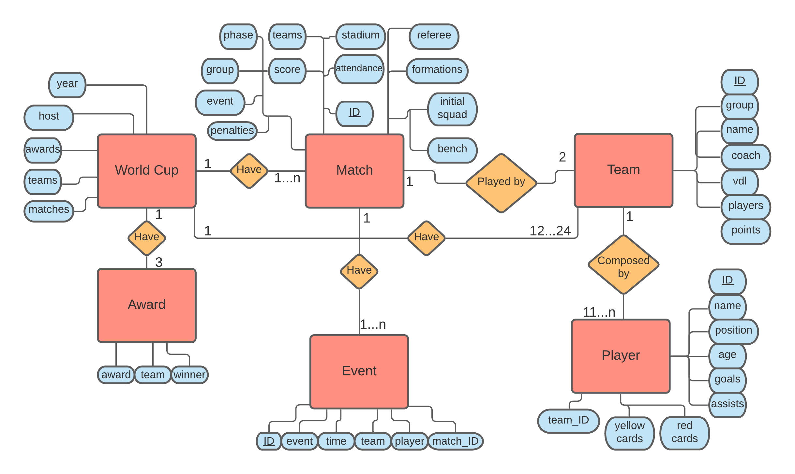
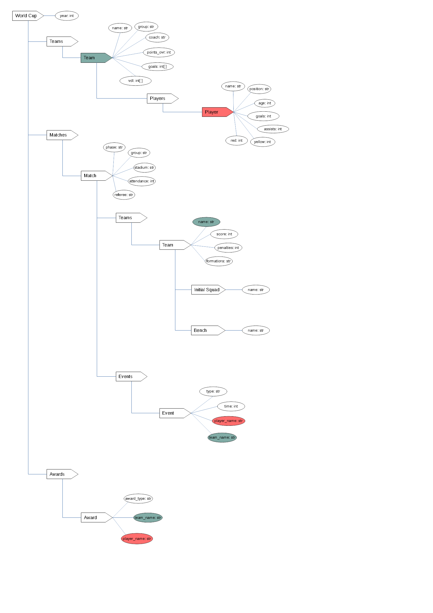

# Estrutura de Arquivos e Pastas

~~~
├── README.md  <- arquivo apresentando a proposta
│
├── data
│   ├── external       <- dados de terceiros em formato usado para entrada na transformação
│   ├── interim        <- dados intermediários, e.g., resultado de transformação
│   ├── processed      <- dados finais usados para a publicação
│   └── raw            <- dados originais sem modificações
│
├── notebooks          <- Jupyter notebooks ou equivalentes
│
├── slides             <- arquivo de slides em formato PDF
│
├── src                <- fonte em linguagem de programação ou sistema (e.g., Cytoscape)
│   └── README.md      <- instruções básicas de instalação/execução
│
└── assets             <- mídias usadas no projeto
~~~

## `data`

Arquivos de dados usados no projeto, quando isso ocorrer.

## `notebooks`

Testes ou prototipos relacionados ao projeto que tenham sido executados no Jupyter.

## `src`

Projeto na linguagem escolhida, incluindo todos os arquivos de dados e bibliotecas necessários para a sua execução. Dentro dessa pasta sugerimos que você mantenha uma estrutura equivalente ao Eclipse, com uma subpasta `src` onde estarão os fontes e outra subpasta `bin` onde estarão os binários.

 Acrescente na raiz um arquivo `README.md` com as instruções básicas de instalação e execução.

## `assets`

Qualquer mídia usada no seu projeto: vídeo, imagens, animações, slides etc. Coloque os arquivos aqui (mesmo que você mantenha uma cópia no diretório do código).

# Projeto `Construindo um dataset sobre a Copa do Mundo de Futebol Feminino`

# Equipe `AKERS` - `AKERS`

* `Arthur Cemin Baia` - `213259`
* `Fábio Santos Villar` - `234135`
* `José Augusto Nascimento Afonso Marcos` - `200025`

## Resumo do Projeto
> Nosso projeto consiste em reunir informações, em um banco de dados, sobre todas as copas do mundo de futebol feminino realizadas até hoje (1991 - 2019). O projeto envolve, principalmente, funções de webscraping, para retirar e agregar dados de múltiplas fontes não-estruturadas e apresentá-los em dois modelos: Relacional e Hierárquico.

## Slides da Apresentação

[Slides](https://github.com/FabioVillar/MC536-Projeto-Final/blob/main/previa/assets/Apresenta%C3%A7%C3%A3o%20Pr%C3%A9via%20-%20Akers.pdf)
## Modelo Conceitual Preliminar

> Modelo de Entidade-Relacionamento:

## Modelos Lógicos Preliminares

> Modelo lógico relacional:

~~~

WORLDCUP(_id_, host)

TEAM_WC(_id_, year_wc, team_name, coach, group_in_wc, group_points, goals_scored, overall_points, goals_conceded, wins, draws, losses)
  Ocupante chave estrangeira -> WorldCup(year_wc)

PLAYER_WC(_id_, team_id, player_name, age, position, goals, assists, yellow_cards, red_cards, year_wc)
  Ocupante chave estrangeira -> Team_wc(team_id)

MATCH_WC(_id_, penalties, phase, group, teamA, teamB, score, stadium, attendance, referee, formationA, formationB, lineupA, lineupB, reservesA, reservesB, possession, year_wc)
  Ocupante chave estrangeira -> Team_wc(teamA)
  Ocupante chave estrangeira -> Team_wc(teamB)

EVENTS_WC(_id_, match_id, event_desc, match_time, team, player)
  Ocupante chave estrangeira -> Player_wc(player)
  Ocupante chave estrangeira -> Team_wc(team)
  Ocupante chave estrangeira -> Match_wc(match_id)

AWARDS_WC(award_type, year_wc, player_id, team)
  Ocupante chave estrangeira -> Player_wc(player_id)
  Ocupante chave estrangeira -> Team_wc(team)

~~~

> Modelo hierárquico:

## Dataset Preliminar a ser Publicado

título do arquivo/base | link | breve descrição
----- | ----- | -----
`world_cup_1991.json` | `` | `Documento JSON com os dados da Copa do mundo feminina de 1991`

`world_cup_1995.json` | `` | `Documento JSON com os dados da Copa do mundo feminina de 1995`

`world_cup_1999.json` | `` | `Documento JSON com os dados da Copa do mundo feminina de 1999`

`world_cup_2003.json` | `` | `Documento JSON com os dados da Copa do mundo feminina de 2003`

`world_cup_2007.json` | `` | `Documento JSON com os dados da Copa do mundo feminina de 2007`

`world_cup_2011.json` | `` | `Documento JSON com os dados da Copa do mundo feminina de 2011`

`world_cup_2015.json` | `` | `Documento JSON com os dados da Copa do mundo feminina de 2015`

`world_cup_2019.json` | `` | `Documento JSON com os dados da Copa do mundo feminina de 2019`

## Bases de Dados

título do arquivo/base | link | breve descrição
----- | ----- | -----
`FBRef` | `https://fbref.com/en/` | `Fonte de quase todos os dados relacionados às Copas, seleções, partidas e jogadoras`

`Wikipedia` | `https://www.wikipedia.org/` | `Fonte de dados complementares, usados principalmente para aquisição de dados complementares que não estavam presentes na base supracitada`

## Operações realizadas para a construção do dataset

> As operações utilizadas para a construção do dataset se encontram na pasta `src`. Mais precisamente, para a montagem dos arquivos .json, basta executar o arquivo  . Para obter os bancos de dados em SQL e MongoDB, basta seguir as operações contidas em  .

* Extração de dados de fontes não estruturadas: Para toda a composição do projeto, foi utilizado somente webscraping para a obtenção dos dados.

* Integração: Obtivemos dados de dois sites: FBREF e Wikipedia. A utilização de forma mais específica pode ser vista em 
* tratamento de dados
* transformação de dados para facilitar análise e pesquisa

> Se for notebook, ele estará dentro da pasta `notebook`. Se por alguma razão o código não for executável no Jupyter, coloque na pasta `src`. Se as operações envolverem queries executadas atraves de uma interface de um SGBD não executável no Jupyter, como o Cypher, apresente na forma de markdown.

## Perguntas de Pesquisa/Análise Combinadas e Respectivas Análises

> Liste aqui as perguntas de pesquisa/análise e respectivas análises.
> Nem todas as perguntas precisam de queries que as implementam.
> É possível haver perguntas em que a solução é apenas descrita para
> demonstrar o potencial da base.
>
### Pergunta/Análise 1
> * Pergunta 1: Qual a taxa de vitória de cada formação? 
>   
>   * Será feita uma coleta de todas as ocorrências da formação, que está presente nos objetos da classe Match, e, por meio desta, o número de vitórias obtidas por cada seleção que utilizou esta formação. Desta forma, será possível obter a taxa de vitória.

### Pergunta/Análise 2
> * Pergunta 2: Qual a porcentagem de vitória de uma seleção que abre o placar?
>   
>   * Com base nas informações de cada partida, é possível verificar qual seleção abriu o placar em cada partida, e, por meio do resultado final, ver se ela conseguiu a vitória. Fazendo essa análise para cada partida com gols, é possível obter a taxa de vitória.

### Pergunta/Análise 3
> * Pergunta 3: Qual a relação entre a média das idades de uma seleção e seu desempenho na copa?
>   
>   * Cada jogadora tem a sua idade salva como atributo de classe, e, com base nisso e na seleção em que atuam, é possível traçar uma relação entre a média de idade e o desempenho da seleção na Copa.

> Coloque um link para o arquivo do notebook que executa o conjunto de queries. Ele estará dentro da pasta `notebook`. Se por alguma razão o código não for executável no Jupyter, coloque na pasta `src`. Se as queries forem executadas atraves de uma interface de um SGBD não executável no Jupyter, como o Cypher, apresente na forma de markdown.

