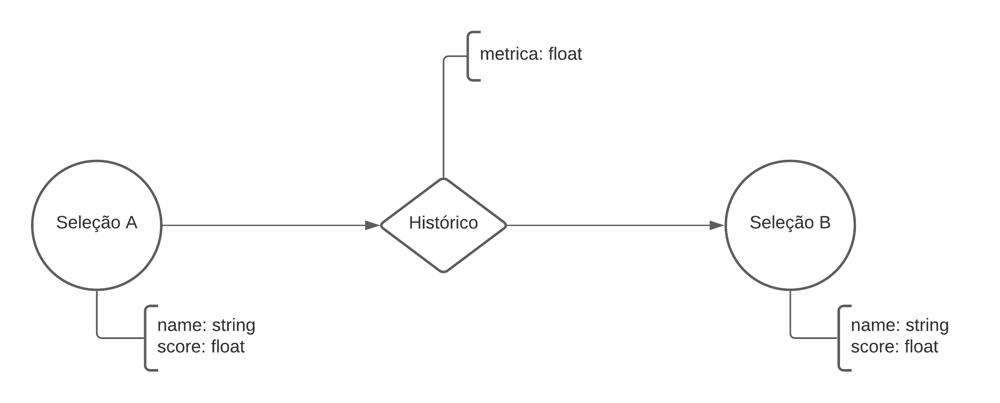

# Lab08 - Modelo Lógico e Análise de Dados em Grafos
Estrutura de pastas:
```
├── README.md  <- arquivo apresentando a tarefa
│
└── images     <- arquivos de imagem usados na tarefa
```
# Equipe Akers - Akers
* Arthur Cemim Baia -  213259
* Fábio Santos Villar - 234135
* José Augusto Nascimento Afonso Marcos - 200025
## Modelo Lógico Combinado do Banco de Dados de Grafos


A partir do modelo combinado, podemos fazer uma operação de projeção entre seleções (copa a copa). O intuito disso é montar um grafo cuja associação entre seleções é determinada por uma variável chamada histórico, ou seja, o desempenho da seleção em relação a outra ao longo das copas. Cada desempenho é determinado por diversas características como número de jogos jogados, saldo de gols entre confrontos, expulsões e cartões amarelos, ou seja, por uma função baseada no histórico de partidas entre elas. A cada histórico (isto é, a aresta que liga duas seleções), é estabelecido uma métrica que indica qual seleção tem um histórico melhor que a outra. Cada seleção, além disso, possui um score próprio, total, fruto de todas as relações com outras seleções e baseado também nas características do time na copa atual.




## Perguntas de Pesquisa/Análise Combinadas e Respectivas Análises

### Pergunta/Análise 1
  * Qual seleção é mais provável de ganhar a copa neste ano?
    * Podemos usar alguns métodos para verificar aspectos que possam ter relação com a seleção ganhadora. Um deles é o método de centralidade baseado em grau de ligação, onde poderíamos fazer a associação do desempenho da seleção baseada no número de relações que ela tem contra todas as outras (por exemplo, indicando que ela possui mais tradição, já que participou de mais copas). Além disso, outro método possível é pela análise usando centralidade e Page-rank, onde scores positivos contra seleções com bons scores (que podem funcionar como importancia), poderiam indicar a possível performance geral da seleção.

### Pergunta/Análise 2
  * Qual a espectativa de performance de uma seleção X que nunca jogou uma copa?
    * Podemos encarar as métricas entre seleções como distâncias, onde poderíamos achar clusteres de seleções com características parecidas com a seleção que está ingressando na copa, fazendo uma análise de comunidades para encaixar a seleção em questão em alguma categoria, possivelmente podendo predizer qual será seu desempenho.
