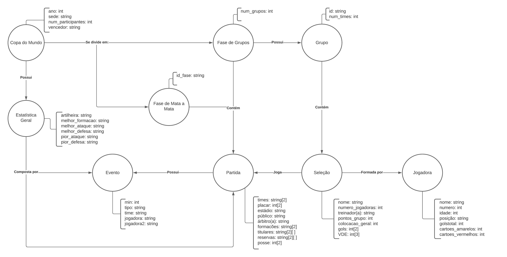
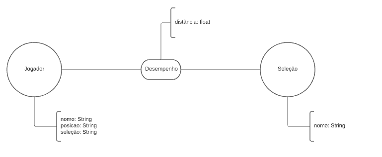
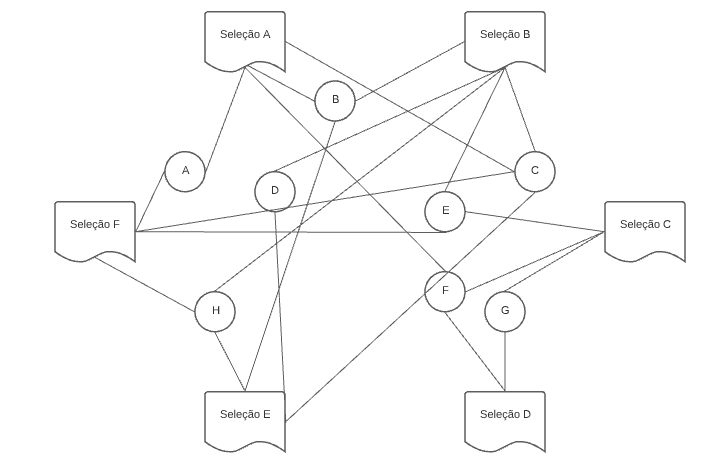

# Lab08 - Modelo Lógico e Análise de Dados em Grafos
Estrutura de pastas:
```
├── README.md  <- arquivo apresentando a tarefa
│
└── images     <- arquivos de imagem usados na tarefa
```
# Equipe Akers - Akers
* Arthur Cemin Baia -  213259
* Fábio Santos Villar - 234135
* José Augusto Nascimento Afonso Marcos - 200025
## Modelo Lógico Combinado do Banco de Dados de Grafos



## Perguntas de Pesquisa/Análise Combinadas e Respectivas Análises
### Pergunta/Análise 1
  * Pergunta 1
    * [Responder aqui]
