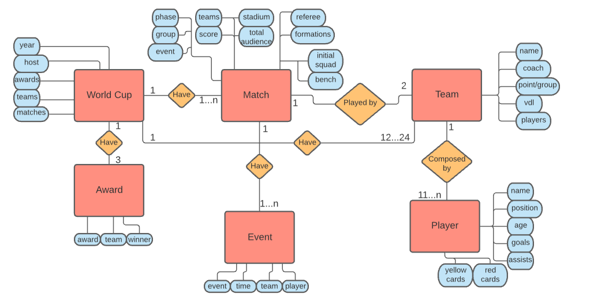
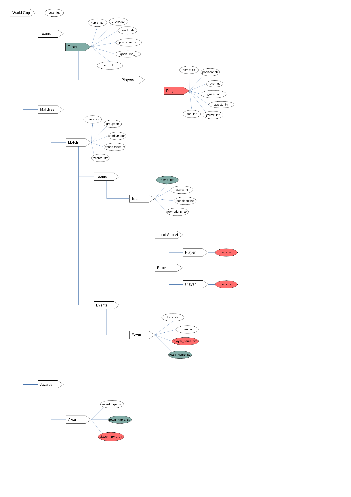

# Estrutura de Arquivos e Pastas

~~~
├── README.md  <- arquivo apresentando a proposta
│
├── data
│   ├── external       <- dados de terceiros em formato usado para entrada na transformação
│   ├── interim        <- dados intermediários, e.g., resultado de transformação
│   ├── processed      <- dados finais usados para a publicação
│   └── raw            <- dados originais sem modificações
│
├── notebooks          <- Jupyter notebooks ou equivalentes
│
├── slides             <- arquivo de slides em formato PDF
│
├── src                <- fonte em linguagem de programação ou sistema (e.g., Cytoscape)
│   └── README.md      <- instruções básicas de instalação/execução
│
└── assets             <- mídias usadas no projeto
~~~

## `data`

Arquivos de dados usados no projeto, quando isso ocorrer.

## `notebooks`

Testes ou prototipos relacionados ao projeto que tenham sido executados no Jupyter.

## `src`

Projeto na linguagem escolhida, incluindo todos os arquivos de dados e bibliotecas necessários para a sua execução. Dentro dessa pasta sugerimos que você mantenha uma estrutura equivalente ao Eclipse, com uma subpasta `src` onde estarão os fontes e outra subpasta `bin` onde estarão os binários.

 Acrescente na raiz um arquivo `README.md` com as instruções básicas de instalação e execução.

## `assets`

Qualquer mídia usada no seu projeto: vídeo, imagens, animações, slides etc. Coloque os arquivos aqui (mesmo que você mantenha uma cópia no diretório do código).

# Projeto `Construindo um dataset sobre a Copa do Mundo de Futebol Feminino`

# Equipe `AKERS` - `AKERS`

* `Arthur Cemin Baia` - `213259`
* `Fábio Santos Villar` - `234135`
* `José Augusto Nascimento Afonso Marcos` - `200025`

## Resumo do Projeto
> Nosso projeto consiste em reunir informações, em um banco de dados, sobre todas as copas do mundo de futebol feminino realizadas até hoje (1991 - 2019). O projeto envolve, principalmente, funções de webscraping, para retirar e agregar dados de múltiplas fontes não-estruturadas e apresentá-los em dois modelos: Relacional e Hierárquico.

## Slides da Apresentação
> Coloque aqui o link para o PDF da apresentação prévia

## Modelo Conceitual Preliminar

> Modelo de Entidade-Relacionamento:

## Modelos Lógicos Preliminares

> Modelo lógico relacional:

~~~

WorldCup(_year_wc_, host, winner)
Team_wc(_team_id_, year_wc, team_name, coach, group_in_wc, group_points, ovr_points, group, goals_scored, goals_suffered, wins, draws, losses)
  Ocupante chave estrangeira -> WorldCup(year_wc)
Player_wc(_player_id_, team_id, player_name, age, position, goals, yellow_cards, red_cards)
  Ocupante chave estrangeira -> Team_wc(team_id)
Match_wc(_match_id_, penalties, phase, group, teamA, teamB, scoreA, scoreB, stadium, attendance, referee, formationA, formationB, lineupA, lineupB, benchA, benchB)
  Ocupante chave estrangeira -> Team_wc(teamA)
  Ocupante chave estrangeira -> Team_wc(teamB)
Events_wc(_event_id_, match_id, event_type, match_time, team_id, player_id)
  Ocupante chave estrangeira -> Player_wc(player_id)
  Ocupante chave estrangeira -> Team_wc(team_id)
  Ocupante chave estrangeira -> Match_wc(match_id)
Awards(award_type, year_wc, player_id, team_id)
  Ocupante chave estrangeira -> Player_wc(player_id)
  Ocupante chave estrangeira -> Team_wc(team_id)

~~~

> Modelo hierárquico:

## Dataset Preliminar a ser Publicado
> Elencar os arquivos/bases preliminares dos datasets serão publicados publicados.

título do arquivo/base | link | breve descrição
----- | ----- | -----
`<título do arquivo/base>` | `<link para arquivo/base>` | `<breve descrição do arquivo/base>`

> Os arquivos finais do dataset publicado devem ser colocados na pasta `data`, em subpasta `processed`. Outros arquivos serão colocados em subpastas conforme seu papel (externo, interim, raw). A diferença entre externo e raw é que o raw é em formato não adaptado para uso. A pasta `raw` é opcional, pois pode ser substituída pelo link para a base original da seção anterior.
> Coloque arquivos que não estejam disponíveis online e sejam acessados pelo notebook. Relacionais (usualmente CSV), XML, JSON e CSV ou triplas para grafos.

## Bases de Dados
> Elencar as bases de dados fonte utilizadas no projeto.

título da base | link | breve descrição
----- | ----- | -----
`<título da base>` | `<link para a página da base>` | `<breve descrição da base>`

## Operações realizadas para a construção do dataset

> Coloque um link para o arquivo do notebook, programas ou workflows que executam as operações de construção do dataset:
* extração de dados de fontes não estruturadas como, por exemplo, páginas Web
* agregação de dados fragmentados obtidos a partir de API
* integração de dados de múltiplas fontes
* tratamento de dados
* transformação de dados para facilitar análise e pesquisa

> Se for notebook, ele estará dentro da pasta `notebook`. Se por alguma razão o código não for executável no Jupyter, coloque na pasta `src`. Se as operações envolverem queries executadas atraves de uma interface de um SGBD não executável no Jupyter, como o Cypher, apresente na forma de markdown.

## Perguntas de Pesquisa/Análise Combinadas e Respectivas Análises

> Liste aqui as perguntas de pesquisa/análise e respectivas análises.
> Nem todas as perguntas precisam de queries que as implementam.
> É possível haver perguntas em que a solução é apenas descrita para
> demonstrar o potencial da base.
>
### Pergunta/Análise 1
> * Pergunta 1
>   
>   * Explicação sucinta da análise que será feita ou conjunto de queries que
>     responde à pergunta.

### Pergunta/Análise 2
> * Pergunta 2
>   
>   * Explicação sucinta da análise que será feita ou conjunto de queries que
>     responde à pergunta.

### Pergunta/Análise 3
> * Pergunta 3
>   
>   * Explicação sucinta da análise que será feita ou conjunto de queries que
>     responde à pergunta.

> Coloque um link para o arquivo do notebook que executa o conjunto de queries. Ele estará dentro da pasta `notebook`. Se por alguma razão o código não for executável no Jupyter, coloque na pasta `src`. Se as queries forem executadas atraves de uma interface de um SGBD não executável no Jupyter, como o Cypher, apresente na forma de markdown.
